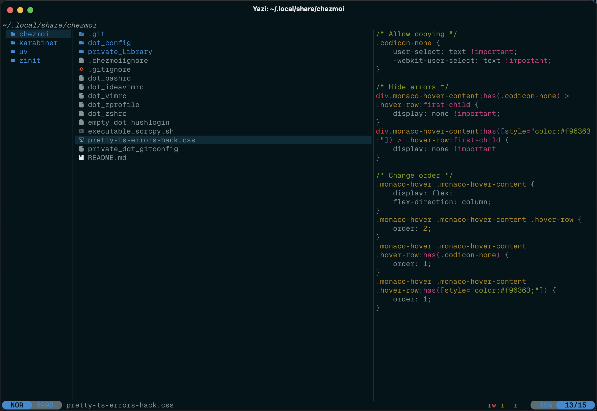

# 🏯 Solarized Osaka for Yazi

## 👀 Preview



## 🎨 Installation

<!-- Please replace "username/example" with your repository name. -->

```sh
ya pack -a mukhlisakbr/solarized-osaka
```

## ⚙️ Usage

<!--
Please replace "example" with your flavor name.

If your flavor uses a light color scheme, use "light" instead of "dark" wherever it appears below.
-->

To set it as your dark flavor, change the content of your `theme.toml` to:

```toml
[flavor]
dark = "solarized-osaka"
```

Make sure your `theme.toml` doesn't contain anything other than `[flavor]`, unless you want to override certain styles of this flavor.

See the [Yazi flavor documentation](https://yazi-rs.github.io/docs/flavors/overview) for more details.
